SUPSI 2024-25  
Data Visualization course, C-D3202E 
Teacher Giovanni Profeta

# What Makes Music Change?
Authors: [Joshua David Moshi](https://github.com/JDMF-05), [Federico Lombardo](https://github.com/2vinaa), [Mattia Dellamonica](https://github.com/MDellam)

[What Makes Music Change?](https://visualization.cargo.site/)

## How to read

For the site development we used cargo, while it's a very useful tool, it doesn't permit us to have the full .html, .css and .js files.

So we've reuploded the structure on cargo in this part of the repository:

[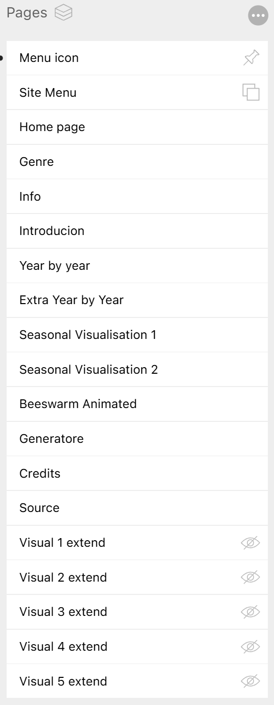]()

## Which is which
### Menu icon

### Site Menu

### Home page

### Genre

### Info
[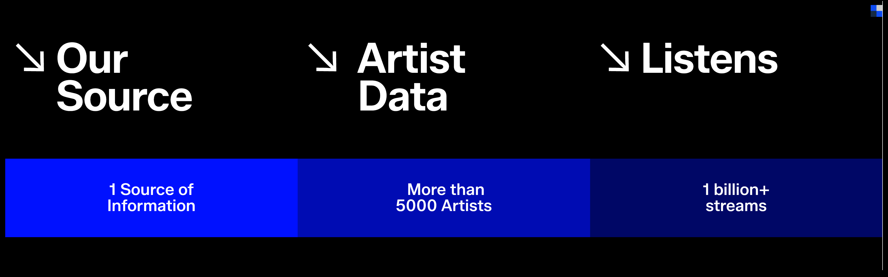]()
### Introduction
[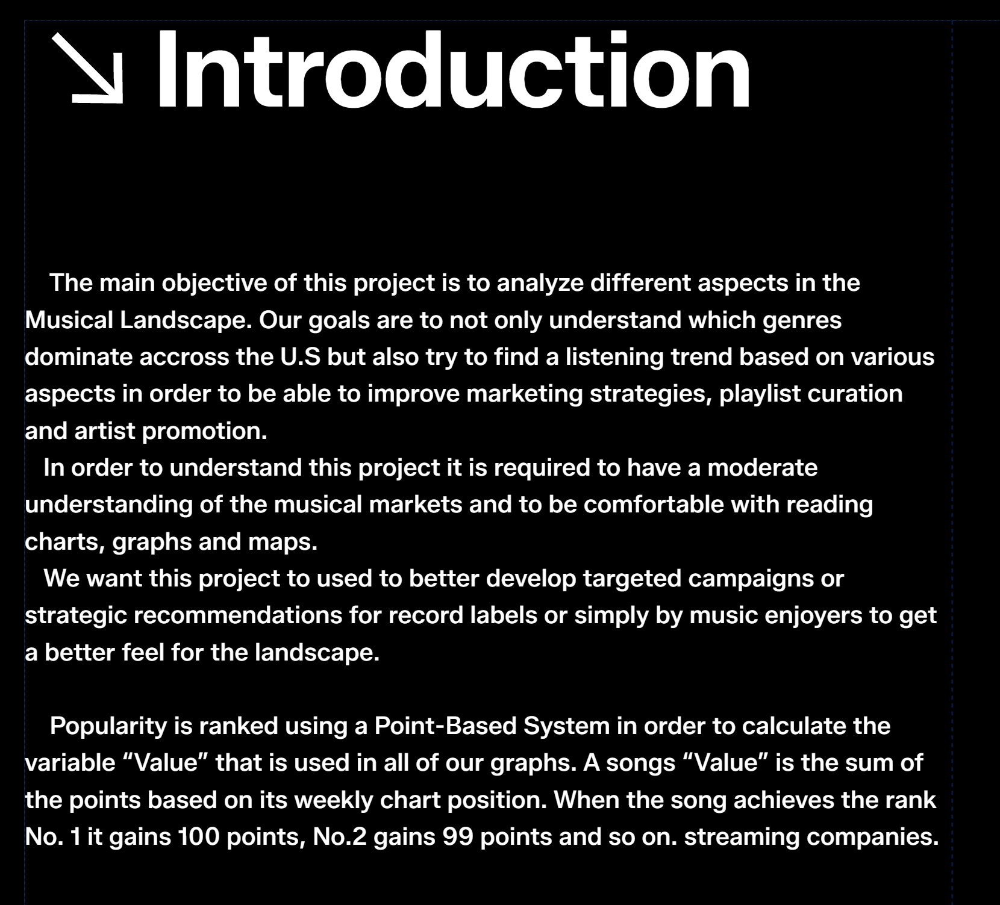]()
### Year by year
[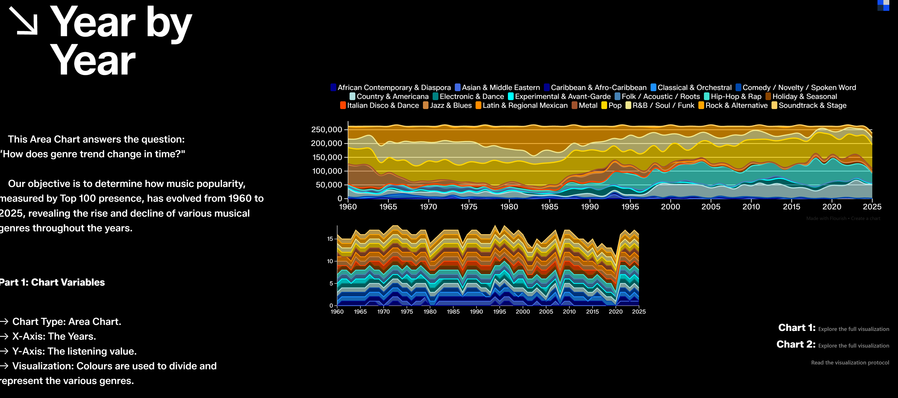]()
### Extra Year by year
[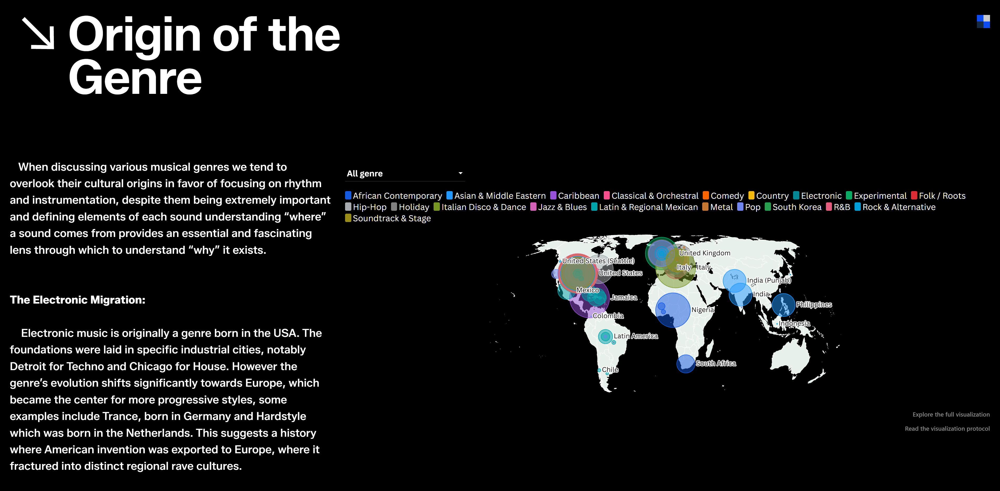]()
### Seasonal Visualization 1
[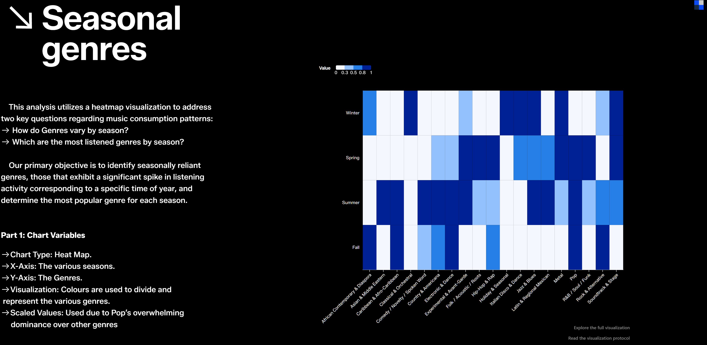]()
### Seasonal Visualization 2
[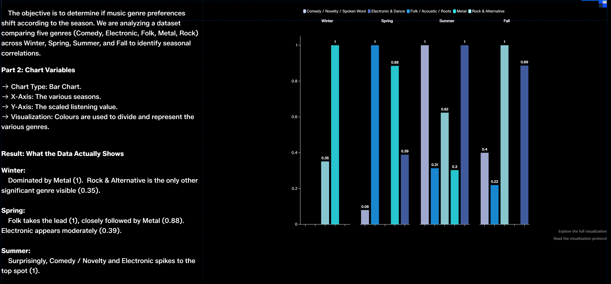]()
### Beeswarm Animated
[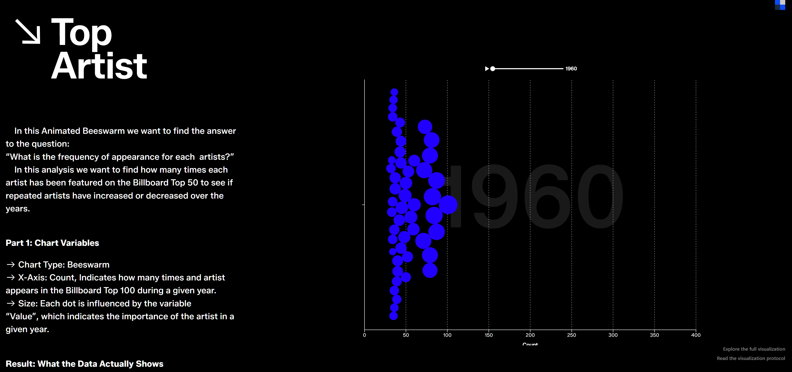]()
### Generatore
[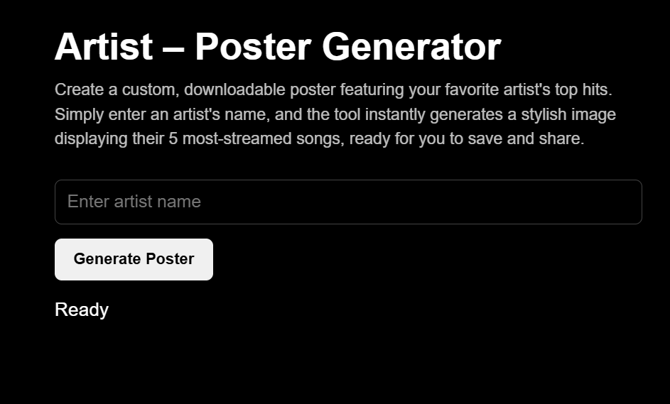]()
### Credits 
[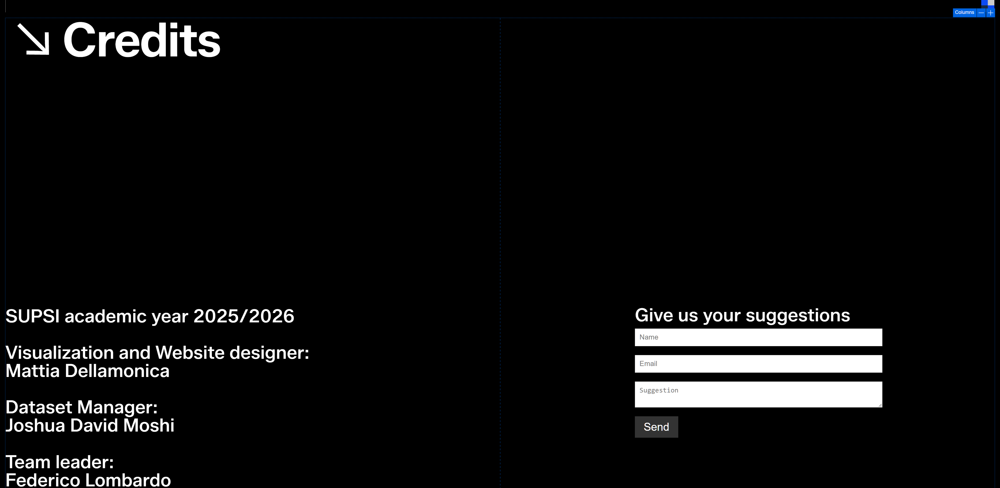]()
### Source

### Visual 1 extend
[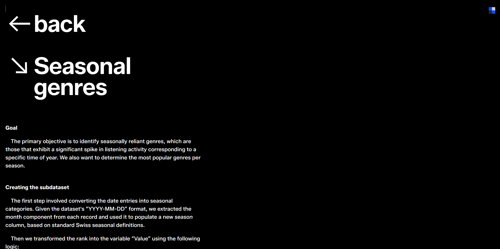]()
### Visual 2 extend
[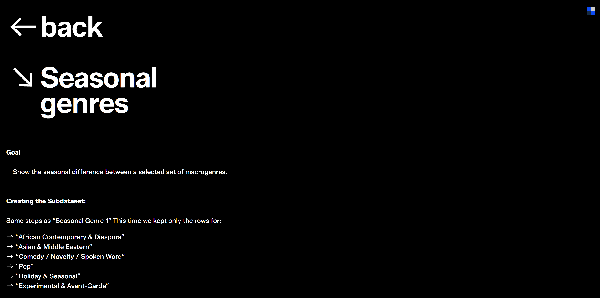]()
### Visual 3 extend

### Visual 4 extend
[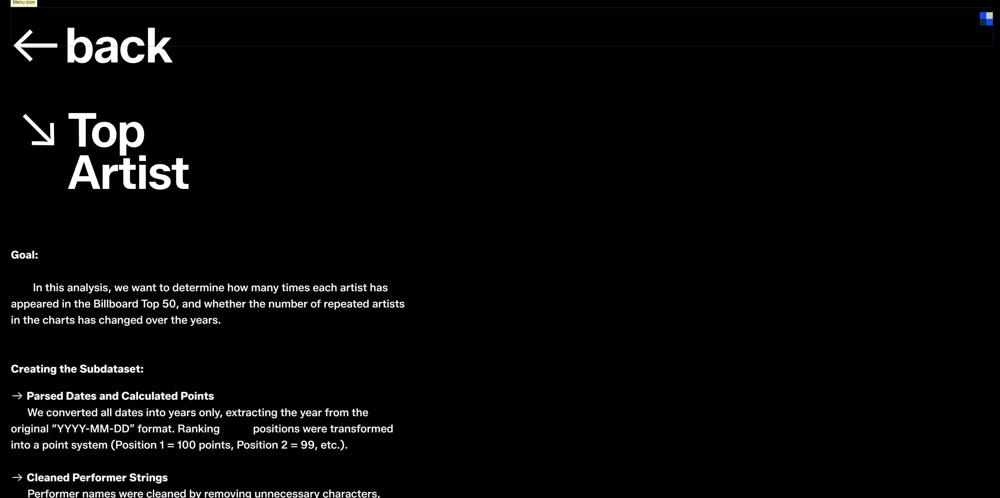]()
### Visual 5 extend

